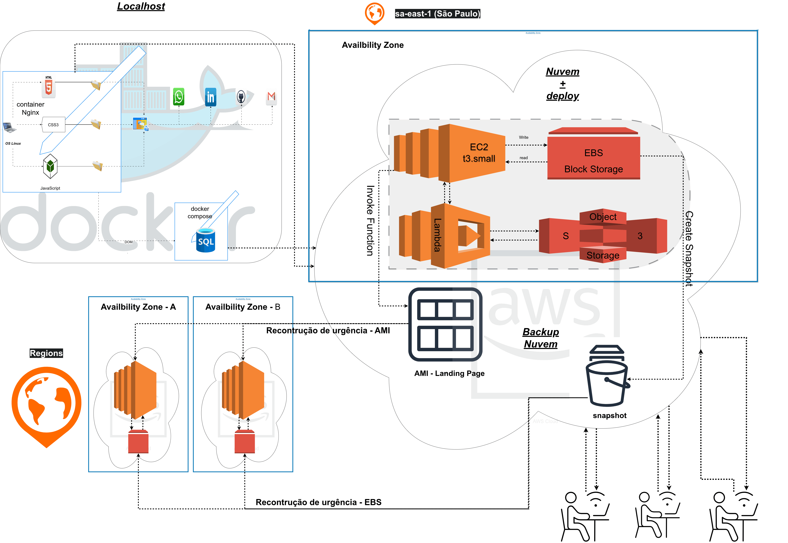

----------------------------------------------------------------------------------------------------------------------------------

## 📑 Índice

* 📖 Sobre o Projeto
* 🎯 Objetivos
* 🏗️ Arquitetura da Solução
* ☁️ Serviços AWS Utilizados
* 🛠️ Tecnologias e Ferramentas
* 🚀 Fluxo da Infraestrutura
* 📂 Estrutura do Repositório
* 📚 Aprendizados
* 👨‍💻 Autor
* 📄 Licença

----------------------------------------------------------------------------------------------------------------------------------
* 📖 Sobre o Projeto:

# ☁️ Infraestrutura AWS para Hospedagem de uma Landing Page

Este projeto foi desenvolvido como parte do desafio prático do **Bootcamp Code Girls 2025 - DIO**, 
com o objetivo de aplicar conceitos fundamentais de computação em nuvem utilizando serviços da AWS.

A proposta consiste em apresentar uma arquitetura de infraestrutura para hospedagem de uma Landing Page, 
demonstrando o fluxo completo da aplicação desde o ambiente de desenvolvimento local, coleta de fluxo de usuários e até sua implantação em nuvem.

O diagrama foi elaborado para representar a integração entre tecnologias como **Docker**, **Nginx**, **Amazon EC2**, **Amazon EBS**, **Amazon S3**, **AWS Lambda**, 
além das estratégias de backup utilizando **AMIs** e **Snapshots**, evidenciando aspectos de disponibilidade, persistência dos dados e recuperação de ambientes.

Além da implementação da arquitetura, este repositório busca documentar o raciocínio adotado durante o desafio, reunindo diagramas, 
documentação técnica e os principais conceitos estudados ao longo do módulo.

----------------------------------------------------------------------------------------------------------------------------------

* 🎯 Objetivos:

Este projeto foi desenvolvido para os seguintes fins: 
§ Atender as solicitações do desafio DIO: 
§ Encerramento do módulo 2;

----------------------------------------------------------------------------------------------------------------------------------

🏗️ Arquitetura da Solução:

Arquitetura Animada... 
• Para melhor compreenção siga sempre o fluxo das setas.

  

Arquitetura Estática...

----------------------------------------------------------------------------------------------------------------------------------

☁️ Serviços AWS Utilizados:

## ☁️ Serviços AWS Utilizados

| Serviço | Categoria | Função |
|----------|-----------|---------|
| Amazon EC2 | Computação | Hospeda a Landing Page e executa o Nginx. |
| Amazon EBS | Armazenamento em Bloco | Armazena os dados da instância EC2. |
| Amazon S3 | Armazenamento de Objetos | Armazena backups e snapshots. |
| AWS Lambda | Computação Serverless | Automatiza tarefas da infraestrutura. |
| Amazon Machine Image (AMI) | Imagem de Máquina | Permite criar imagens completas da instância. |
| Amazon EBS Snapshot | Backup | Realiza backups incrementais dos volumes EBS. |

----------------------------------------------------------------------------------------------------------------------------------

* 🛠️ Tecnologias e Ferramentas:

| TECH Localhost | Diagrama Infraestrutura |
|----------------|-------------------------|
| OS Linux / Ubuntu | Drawio |
| VSCode |
| HTML5 / JINJA2 |
| CSS3 |
| JavaScript / DOM |
| SQL / SQLite |
| Nginx |
| Docker / Docker Compose |

----------------------------------------------------------------------------------------------------------------------------------

* 🚀 Fluxo da Infraestrutura:

O fluxo parte de a simulação de localhost para o desenvolvimento e pré-produção, 
e para o ambiente de Clould com a prestação de serviços de deploy feito pela AWS.

----------------------------------------------------------------------------------------------------------------------------------

* 📂 Estrutura do Repositório:

| Tecnologia | Recursos / O que fornece no projeto |
|---|---|
| HTML5 | Estrutura semântica da Landing Page, organização dos elementos da interface e conteúdo apresentado ao usuário. |
| CSS3 | Estilização visual da Landing Page, layout, responsividade, cores, componentes e experiência de usuário. |
| JavaScript | Interatividade da página, manipulação do DOM, captura de eventos dos usuários e comunicação com recursos do sistema. |
| AWS Cloud | Infraestrutura em nuvem para hospedagem, processamento e armazenamento da aplicação. |
| EC2 (t3.small) | Servidor virtual responsável pela execução da aplicação, hospedagem dos serviços e processamento das requisições. |
| EBS (Block Storage) | Armazenamento em bloco conectado à EC2 para persistência de dados e arquivos do sistema. |
| Lambda | Execução de funções sob demanda para processamento de tarefas sem necessidade de gerenciar servidores diretamente. |
| S3 (Object Storage) | Armazenamento de objetos como imagens, arquivos estáticos, backups e recursos da aplicação. |

----------------------------------------------------------------------------------------------------------------------------------

* 📚 Aprendizados:

Com estes 1º e 2º módulos, eu consegui ter uma melhor visão de versionamentos com Git e GitHub, aprofundando mais aos conceitos que eu já conhecia pouco. tive tambem uma absorvição com o tema "Clould", pois eu ainda não tinha pisado por essas terras, creio que por eu ja ter uma plataforma desenvolvida ajudou muito à compreensão.

----------------------------------------------------------------------------------------------------------------------------------

* 👨‍💻 Autor:
Autoria de Wellington Pereira da Silva.

----------------------------------------------------------------------------------------------------------------------------------

* 📄 Licença:

Por ser um repositório didático, eu decidi não usar licenças.

----------------------------------------------------------------------------------------------------------------------------------